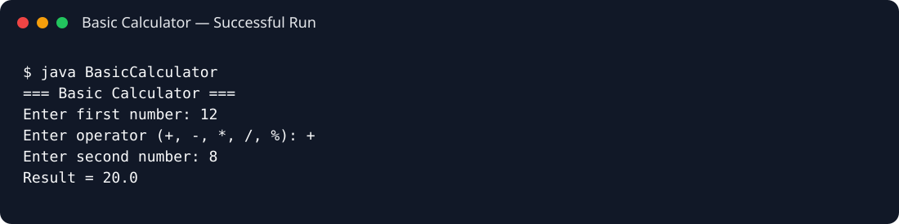

# Basic Calculator

A command-line calculator built with Java to demonstrate core programming fundamentals, user input, operators, switch-case logic, and input validation.

## Features

- Addition, subtraction, multiplication, division, and modulo
- Console-based user interaction
- Division-by-zero and modulo-by-zero validation
- Simple, readable Java implementation

## Run

```bash
javac src/BasicCalculator.java
java -cp src BasicCalculator
```

## Sample Execution



## Concepts Demonstrated

Java fundamentals • `Scanner` • `switch` • conditional validation • arithmetic operations
