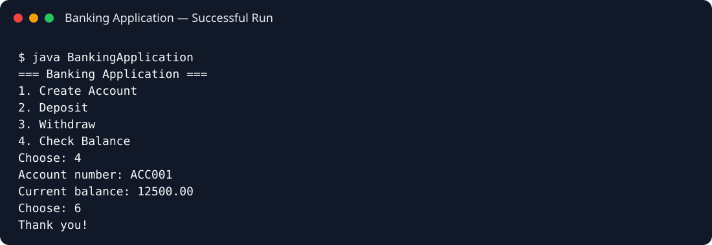

# Banking Application

A console-based Java banking application demonstrating object-oriented design, encapsulation, account management, transaction logic, and input validation.

## Features

- Create bank accounts
- Deposit funds
- Withdraw funds
- Check account balance
- View account details
- Duplicate-account and insufficient-balance validation

## Concepts Demonstrated

- Object-oriented programming
- Encapsulation
- `HashMap` collections
- Methods and control flow
- Console input validation

## Run

```bash
javac src/*.java
java -cp src BankingApplication
```

## Sample Execution



> **Note:** This is an educational console application and is not intended for real financial use.
