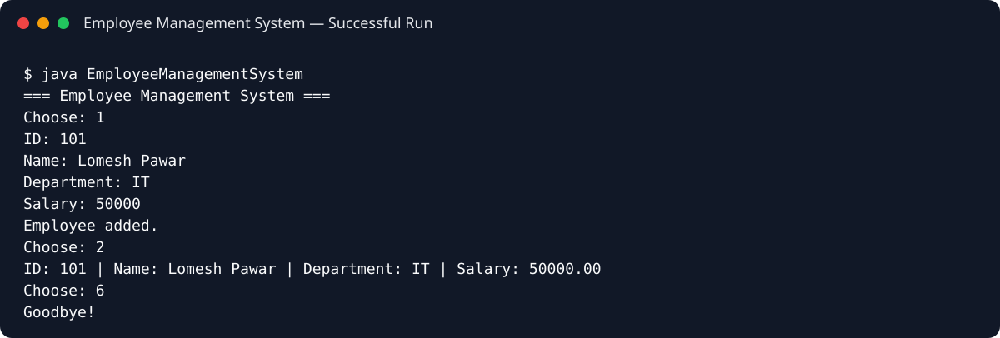

# Employee Management System

A Java console application for managing employee records using object-oriented programming and an in-memory collection.

## Features

- Add employees
- View employee records
- Search by employee ID
- Update employee details
- Delete employees
- Input validation and duplicate-ID protection

## Concepts Demonstrated

- Classes and objects
- Encapsulation
- `ArrayList`
- CRUD-style application logic
- Loops and `switch`
- Exception handling

## Run

```bash
javac src/*.java
java -cp src EmployeeManagementSystem
```

## Sample Execution


