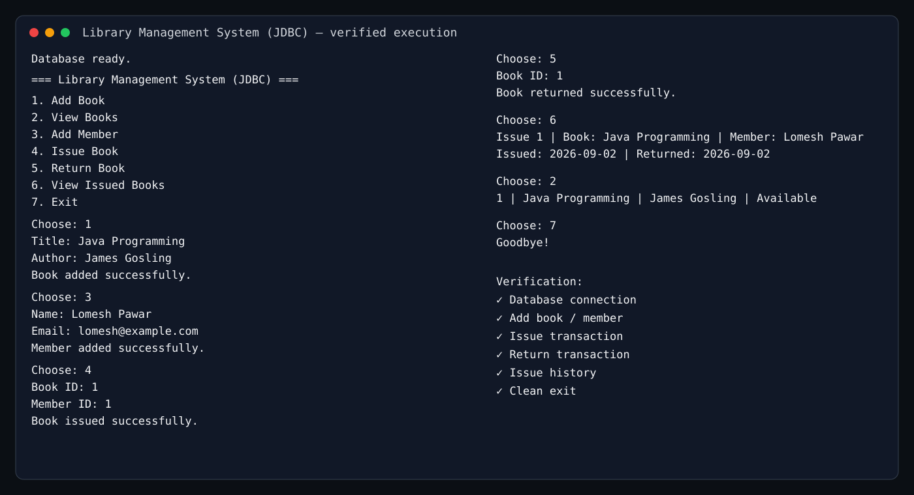

# Library Management System — JDBC

A console-based Library Management System built with Java, JDBC, and MySQL.

## Requirements
- JDK 17+
- MySQL 8+
- MySQL Connector/J

## Database Setup

Create the database in MySQL:

```sql
CREATE DATABASE library_db;
```

## Configure Credentials

The application reads database settings from environment variables:

- `LIBRARY_DB_URL` — optional, defaults to `jdbc:mysql://localhost:3306/library_db`
- `LIBRARY_DB_USER` — optional, defaults to `root`
- `LIBRARY_DB_PASSWORD` — required

Windows PowerShell example:

```powershell
$env:LIBRARY_DB_PASSWORD="your_mysql_password"
```

## Run

Place MySQL Connector/J in this project folder. For example, if the file is `mysql-connector-j-9.x.x.jar`:

```powershell
javac -cp ".;mysql-connector-j-9.x.x.jar" src/*.java
java -cp ".;src;mysql-connector-j-9.x.x.jar" LibraryManagementJDBC
```

## Features
- Add books
- View books
- Add members
- Issue books
- Return books
- View issue history
- Prepared statements
- Transaction handling with commit/rollback
- Foreign-key relationships
- Input validation

## Execution Evidence



The included execution evidence demonstrates successful database initialization, book issue/return flow, issue-history viewing, and clean application exit.
