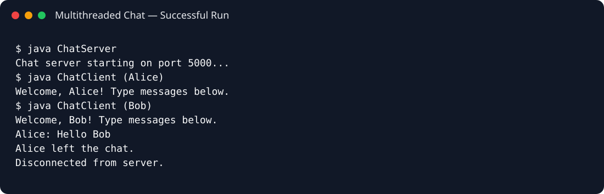

# Multithreaded Chat Application

A console-based client/server chat application built with Java sockets and multithreading. Multiple clients can connect to a shared server and exchange messages.

## Features

- TCP client/server communication
- Multiple concurrent clients
- Username-based chat messages
- `/quit` command for graceful exit
- Thread-safe client collection using `ConcurrentHashMap`

## Concepts Demonstrated

- TCP sockets
- Client/server architecture
- Multithreading
- `ConcurrentHashMap`
- `BufferedReader` / `PrintWriter`
- Concurrent client handling

## Run

### Terminal 1 — Server

```bash
javac src/*.java
java -cp src ChatServer
```

### Terminal 2 — Client 1

```bash
java -cp src ChatClient
```

### Terminal 3 — Client 2

```bash
java -cp src ChatClient
```

Enter different usernames and exchange messages. Type `/quit` to leave.

## Sample Execution



> **Production note:** A production chat system should add authentication, encryption, message persistence, robust validation, structured logging, and connection management.
